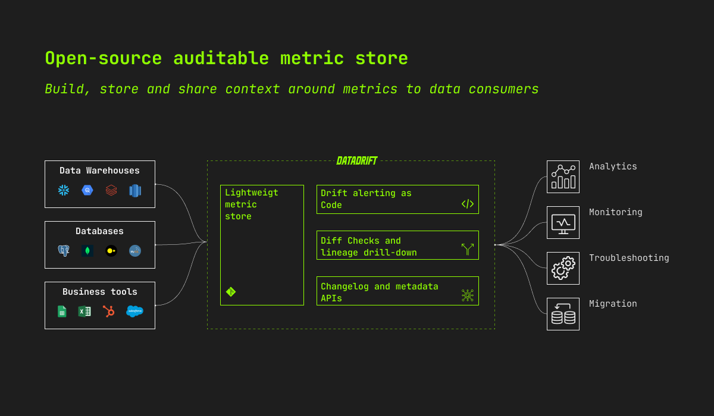
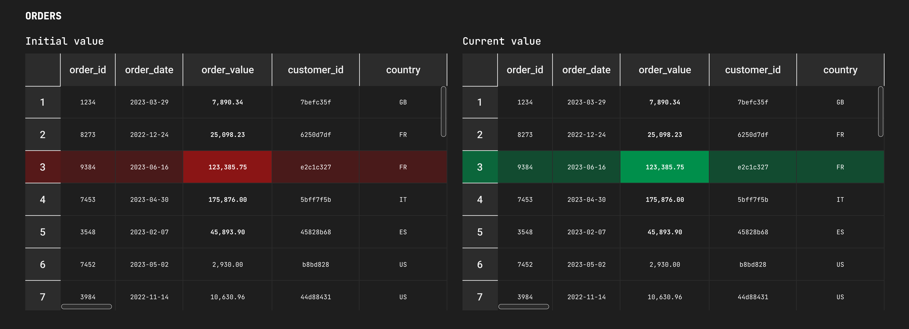

</br>
<p align="center">
  <a href="https://www.data-drift.io">
    <picture>
      <source media="(prefers-color-scheme: dark)" srcset="./datadrift-logo-light.png" width="200px">
      <source media="(prefers-color-scheme: light)" srcset="./datadrift-logo-dark.png" width="200px">
      
    </picture>
  </a>
</p>

<p align="center">
  <a href="https://github.com/data-drift/data-drift/actions/workflows/datadrift-build.yml">
    
  </a>
  <a href="https://main--64be84b7fe2172aa386216b8.chromatic.com/?path=/story/drift-dualtable--simple-case">
    
  </a>
  <a href="https://pypi.org/project/datagit/">
    
  </a>
</p>

<h1 align="center" >The Chronological Metric Store</h1>

<p align="center">Datadrift helps analytics teams provide auditable metrics to demanding data consumers.
</p>

<p align="center">
  <a href="https://www.data-drift.io">
    
  </a>
</p>


# ❓ Why Datadrift?
We know providing actionnable and trusted metrics is hard. Here is how Datadrift helps:

__Metric changelog and metadata__: give data consumers the full context and explain why metrics changed over time.

__Drift detection and troobleshooting__: solve metric quality issues fast and painlessly.

__Open-source__: break free from vendor-lock in and shape your own metric store with open-source collaboration.

</br>

# 🚀 Quickstart

## dbt installation

```
pip install dbt
```

## python installation

```python
pip install datagit
```

For a step-by-step guide on the python installation, see the [docs](https://pypi.org/project/datagit/).
## Datadrift cloud

[Fill the form on our website](https://www.data-drift.io/) to get started with Datadrift Cloud.

</br>

# ⚡️ Use cases

## 🔔 Monitoring drift with custom alerting
Become aware of unknown unknowns in your data quality with metric drift alerting. Monitor the [quality and consistency of your metrics](https://www.data-drift.io/blog/why-data-consumers-do-not-trust-your-reporting-and-you-might-not-even-know-it) over time.

  <a href="https://www.data-drift.io">
    
  </a>

</br>

## 🔬 Troubleshooting & metric reconciliation
Operationalize your monitoring and solve your underlying data quality issue with lineage drill-down to understand the root cause of the problem.

  <a href="https://www.data-drift.io">
    
  </a>

</br>

## 🔄 Safe refactoring and migrations
Migrate without hassle and safely between tools with diff-checks before/after and within/across databases.

  <a href="https://www.data-drift.io">
    
  </a>

</br>

## 🧠 And much more
We'd love to hear from you if you have any other use case. Just open a new [issue](https://github.com/data-drift/data-drift/issues) to tell us more about it and see how we could help!

</br>

# 💚 Contributing

We 💚 contributions big and small. In priority order (although everything is appreciated) with the most helpful first:

- Star this repo to help us get visibility
- [Open an issue](https://github.com/data-drift/data-drift/issues) to share your idea or a bug you might have spotted
- [Become a Design Partner](https://www.data-drift.io/design-partner) to co-built a product you & users love

</br>

# 🗓 Upcoming features

Track planning on [Github Projects](https://github.com/orgs/data-drift/projects/3) and help us prioritising by upvoting or creating [issues](https://github.com/data-drift/data-drift/issues).
