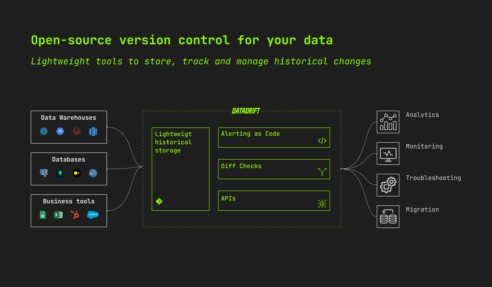

 

  <a href="https://www.data-drift.io">
    <picture>
      <source media="(prefers-color-scheme: dark)" srcset="./datadrift-logo-light.png" width="200px">
      <source media="(prefers-color-scheme: light)" srcset="./datadrift-logo-dark.png" width="200px">
      
    </picture>
  </a>

  
  
  

<h1 align="center" >Data versioning and diffing</h1>

 Datadrift is an agnostic and lightweight storage and version-control technology to track changes to mutable data sources

<a href="https://data-drift.io">Website</a> · <a href="https://www.data-drift.io/blog">Blog</a> · <a href="https://github.com/data-drift/data-drift/issues">Issues

  

# 👋 About

## 🥵 Storing and handling data history is complex and expensive
Tools, databases and warehouses have a hard time tracking and displaying historical changes.
- For a very large majority of companies, there no access to historical state of their own data (ie. how data changes over time)

- For a selected few, keeping track of historical changes is made at a great cost of data engineering and outdated modeling trade-offs

## 👉 Open-source versioned storage and dedicated tools to work with data history
DataDrift makes handling data history easy with modern and open-source version control tools for data. 

### Simple & ligthweight techno for all
- **Easy to implement (<15min)**: Add 1 line of code in your pipeline to historize data. Use the one-click install on your CRM, spreadsheet or any data source (coming soon, open an [issue](https://github.com/data-drift/data-drift/issues) to request a specific connector, or contribute to the community building it directly 😇)

- **Free**: Reduce your storage and optimize your warehouse bill with our ligthweight storage for data history. Storage is done in a dedicated git repository, no additional cost if you use Github.

### Open-source, Open Architecture

- **Secure**: Deploy on your own infra to keep 100% control over your data and access

- **Flexible**: compose your own Datadrift based on our building blocks

- **Integrated**: not another tool to manage in your stack, DataDrift is API-first and stays within your current tools

 

# ⚡️ Use cases
Unlock targeted use-cases with specific tools on top of our versioning and diffing technology. 

Here are some examples of how users leverage Datadrift.

## 🔔 Monitoring drift with custom alerting
Become aware of unknown unknowns in your data quality with data or metric drift alerting. 

> How can you expect a data analyst to detect a data quality issue when all they see is a number that is slightly higher or lower on each report?

Monitor the [quality and consistency of your reporting](https://www.data-drift.io/blog/why-data-consumers-do-not-trust-your-reporting-and-you-might-not-even-know-it) and metrics over time.

## 🔬 Troobleshooting & data reconciliation
Operationalize your monitoring and solve your underlying data quality issue with drill-down across historical data to understand the root cause of the problem.

## 🔄 Safe database/ERP/CRM migrations
Migrate without hassle and safely between tools with comparison and diff-checks before/after and within/across databases.

## 🧠 And much more
We'd love to hear from you if you have any other use case. Just open a new [issue](https://github.com/data-drift/data-drift/issues) to tell us more about it and see how we could help!

 

# 🚀 Quickstart

## Install our versioning and diffing library

[Install Datagit](https://github.com/data-drift/data-drift/tree/main/tools/datagit#datagit) to historise and diff-checks the data you want.

This is a mandatory step to unlock any use cases on top i. You can [learn more about Datagit in this article](https://www.data-drift.io/blog/git-for-your-data).

## Deploy Datadrift locally

Follow our [step-by-step installation guide](https://lucas2vries.notion.site/Step-by-Step-Installation-752ffb590d4e4b27bdb753f9654ef676) to use Datadrift.

## Use our cloud-based product

[Contact our team by filling the form on our website](https://www.data-drift.io/) to get started with Datadrift Cloud.

 

# 💚 Helping us

We 💚 contributions big and small. In priority order (although everything is appreciated) with the most helpful first:

- Star this repo to help us get visibility
- [Become a Design Partner](https://www.data-drift.io/design-partner) to co-built a product you & users love
- [Open an issue](https://github.com/data-drift/data-drift/issues) to share your idea or a bug you might have spotted

 

# 🗓 Upcoming features

## Coming Soon

🌀 Automatic lineage drill-down and diff checks. [Learn more about this feature](https://www.data-drift.io/join-the-waitlist)

## Coming later this year

🗓 Warehouse (BigQuery, Snowflake) & databases (Postgres, MongoDB) native integrations

🗓 BI tools integration

🗓 Gsheet integration

Track planning on [Github Projects](https://github.com/orgs/data-drift/projects/3) and help us prioritising by upvoting or creating [issues](https://github.com/data-drift/data-drift/issues).
