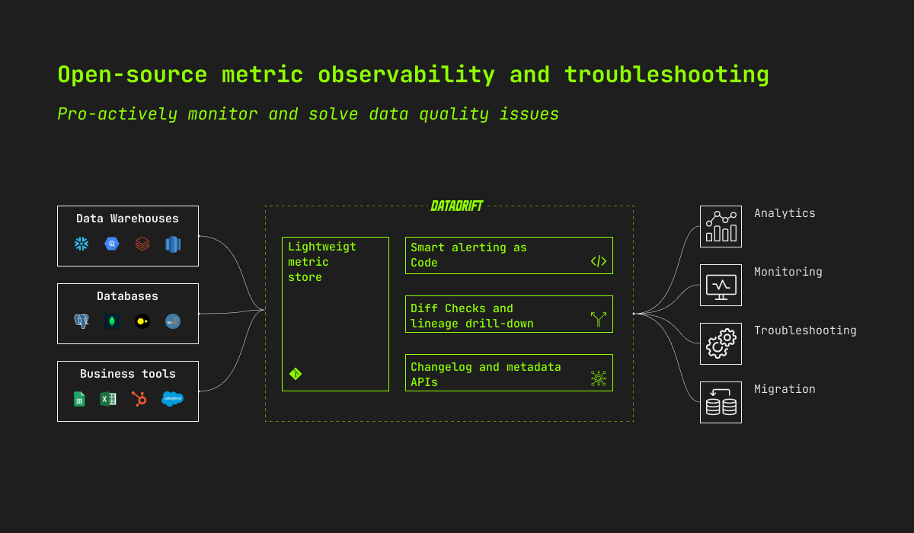
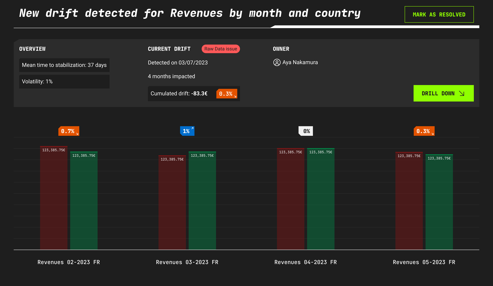
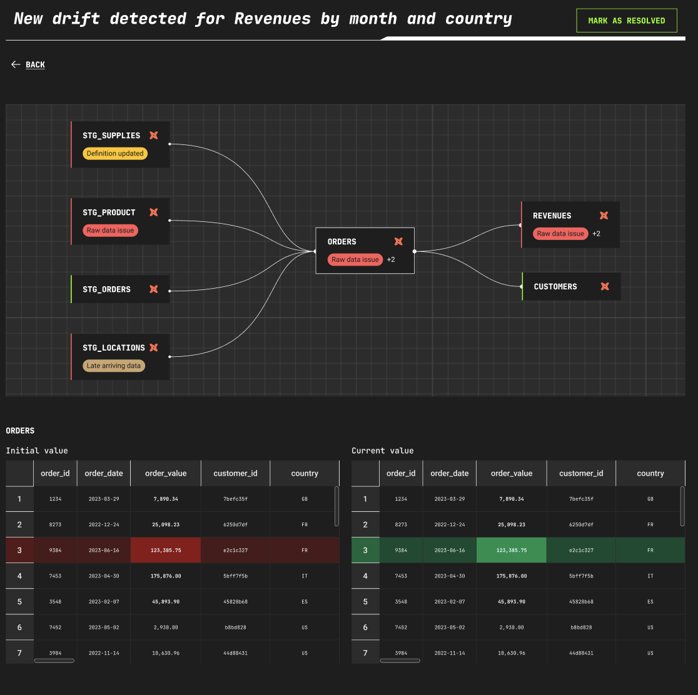
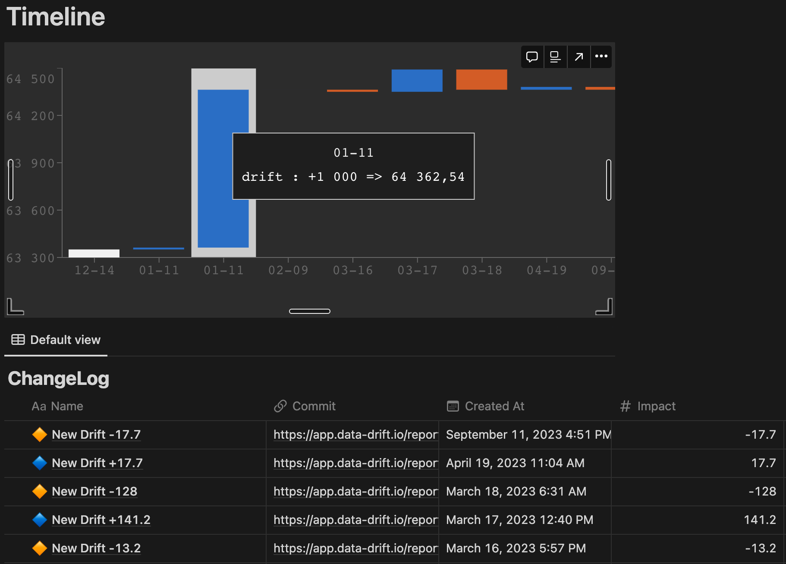

</br>
<p align="center">
  <a href="https://www.data-drift.io">
    <picture>
      <source media="(prefers-color-scheme: dark)" srcset="./datadrift-logo-light.png" width="200px">
      <source media="(prefers-color-scheme: light)" srcset="./datadrift-logo-dark.png" width="200px">
      
    </picture>
  </a>
</p>

<p align="center">
  <a href="https://github.com/data-drift/data-drift/actions/workflows/datadrift-build.yml">
    
  </a>
  <a href="https://main--64be84b7fe2172aa386216b8.chromatic.com/?path=/story/drift-dualtable--simple-case">
    
  </a>
  <a href="https://pypi.org/project/datagit/">
    
  </a>
</p>

<h1 align="center" >Metrics Observability & Troubleshooting</h1>

<p align="center">Datadrift is an open-source monitoring and incident management platform to help data teams deliver trusted and reliable metrics.
</p>

<p align="center">
  <a href="https://www.data-drift.io">
    
  </a>
</p>

Data monitoring tools fail by focusing on static tests (eg. null, unique, expected values) and metadata monitoring (eg. column-level). 
</br> 
**Data teams detect and solve data issues faster with Datadrift's row-level monitoring & troubleshooting.**

</br> 

# 🚀 Quickstart

## dbt installation

```
pip install driftdb
```

[Check the video](https://app.claap.io/sammyt/demo-beta-integration-dbt-c-ApwBh9kt4p-Qp4wXE2MfCzG)

## Python installation

Put the probe in your pipeline.

```python
>>> from datagit import connector
>>> connector.store_metric(dataframe=dataframe, filepath="data/act_metrics_finance/mrr")

```

For a step-by-step guide on the python installation, see the [docs](https://pypi.org/project/datagit/).

## Datadrift cloud

We are in development and we would love to do the installation with you. [Fill the form on our website](https://www.data-drift.io/) so we can do a 15min demo. If the tool solves your problem then the installation require 2\*30 min meeting.

</br>

# ⚡️ Key Features 

## 🔮 Metrics monitoring & custom alerting
Get full visibility into metrics variation and pro-actively detect data quality issues. Become aware of unknown unknowns with metric drift custom alerting. 

  <a href="https://www.data-drift.io">
    
  </a>

</br>

## 🧑‍🎤 Automated troubleshooting & reconciliation
Operationalize your monitoring and solve your underlying data quality issue with lineage drill-down to understand the root cause of the problem.

  <a href="https://www.data-drift.io">
    
  </a>

</br>

## 💎 Metric issues management & changelog
Give visibility to data consumers with metric changelog and in-context explanations.

  <a href="https://www.data-drift.io">
    
  </a>

</br>

## 🧠 And much more
We in the early days of Datadrift. Just open a new [issue](https://github.com/data-drift/data-drift/issues) to tell us more about it and see how we could help!

</br>

# 💚 Contributing

We 💚 contributions big and small. In priority order (although everything is appreciated) with the most helpful first:

- Star this repo to help us get visibility
- [Open an issue](https://github.com/data-drift/data-drift/issues) to share your idea or a bug you might have spotted
- [Become a Design Partner](https://www.data-drift.io/design-partner) to co-built a product you & users love

</br>

# 🗓 Upcoming features

Track planning on [Github Projects](https://github.com/orgs/data-drift/projects/3) and help us prioritising by upvoting or creating [issues](https://github.com/data-drift/data-drift/issues).
