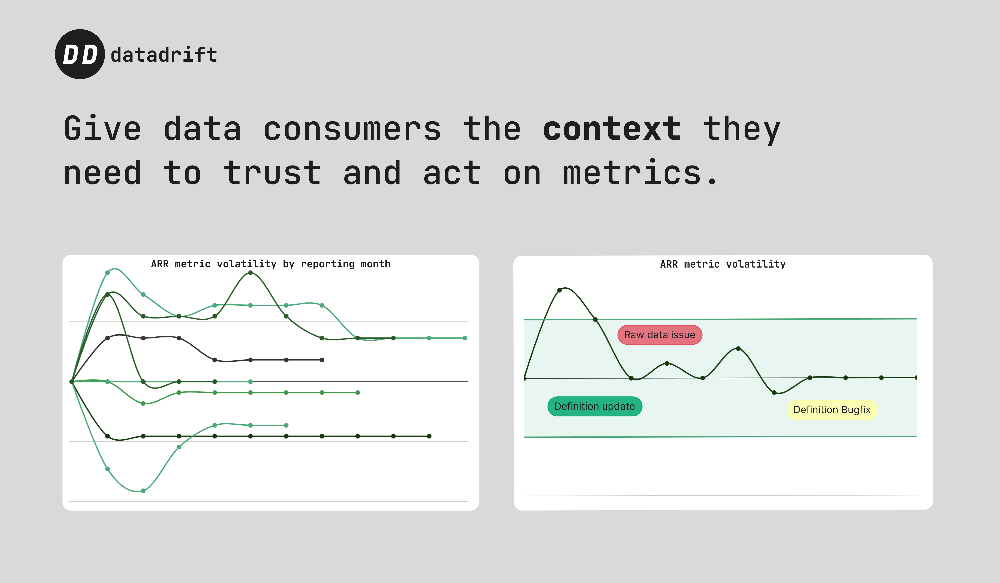
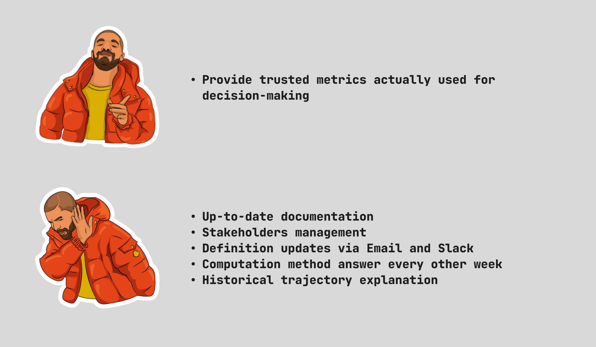

 

  

<h1 align="center" >The Context Layer for your Metrics</h1>

Supercharge your semantic layer with context & observability to built trusted and actionnable metrics

<a href="https://data-drift.io">Website</a> · <a href="https://www.data-drift.io/blog">Blog</a> · <a href="https://github.com/data-drift/data-drift/issues">Issues

 

  

 

# 👋 About

## The Problem: Data consumers interact with raw metrics only. Context is key to make metrics trusted and actionable.  

 
Most data consumers never query a data warehouse table, yet use data on a daily basis through the lens of metrics.  

To trust metrics and make decisions based on them, we need to guarante the quality of the metrics itself (not only the underlying tables) and give (a lot of) context around it.

 
Context is vital because is gives data consumers awareness of: 

- **Computation**: how a metric was calculated and associated caveats  

- **Governance**: who computed the metric, who reviewed it and who acts on it

- **Changelog**: when was the metric computed, when was it last updated and what was the impact of the change  

- **Historical trajectory**: what happened to the metric overtime to prevent misinterpretation (remember the reason of that single unexpected revenue drop last quarter?)

 

  

Data teams be like...(yes, providing context is hard)

 

## The Solution: Datadrift, the open-source context layer for data-driven companies

- Comprehensive **metadata** to certify a quality standard for metrics  

- Easy governance with **version control and historisation**

- Usable **changelog and audit trail** of a metric lifecycle for data consumers  

- Visibility and **centralized knowledge** of a metric’s historical trajectory

 

**Open-source, Open Architecture:**

- **Flexible**: compose your own context layer based on our building blocks  

- **Secure**: deploy on your own infra to keep control over your data  

- **Integrated**: not another tool to manage in your stack, use datadrift directly from current tools (dbt, BI)

 

# 🚀 Quickstart

## Deploy locally
Coming soon. In the meantime, you can you [join our Design Partner Programme.](https://www.data-drift.io/design-partner)

## Use our cloud-based product
[Contact our team by filling the form on our website](https://www.data-drift.io/) to get started with Datadrift Cloud.

 

# 💚 Helping us

We 💚 contributions big and small. In priority order (although everything is appreciated) with the most helpful first:

- Star this repo to help us get visibility
- Open an issue to share your idea or a bug you might have spotted

 

# 🗓 Roadmap

## Released

✅ Metric snapshots and diff checks

✅ Historical trajectory monitoring and alerting

✅ Metric changelog for data consumers

## In progress

🌀 Automatic lineage drill-down and diff checks

🌀 dbt integration

## Next

🗓 Sharing via Slack & emails 

🗓 Warehouse native integration

🗓 BI tools integration

🗓 Gsheet integration

🆕 **Open an issue to share your feature requests**