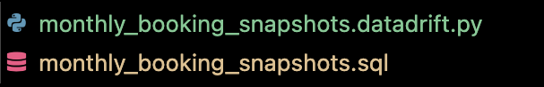

# dbt Snapshot Testing

This document explains how to implement snapshot testing with Datadrift.
Snapshot testing consists in veryfying the data modification, addition or deletion in a metric table does not contain a anomaly.

## Context

You have a metric, and a snapshot assiociated. After each dbt runs, and dbt snapshot runs, we'll run a snapshot-test to detect any anomalies `driftdb snapshot check`.

# Configuration

All the configuration will be inside a python file, positionned by the snapshot file, call `$snapshot_name.datadrift.py`



## Historical data

The `.datadrift.py` exports a `drift_handler` function that defines the rules of alerting for historical data modifications. The different handlers are defined [here](../README.md#drift-handler).

```python
# my_snapshot.datadrift.py
from driftdb.alerting import TresholdDriftHandlerFactory

# This will trigger an alert if one of the historical monthly_metric updates is over the threshold
drift_handler = TresholdDriftHandlerFactory(
    numerical_cols=["monthly_metric"],
    treshold=0,
)
```

If no handler is exported, the default behaviour is to send an alert if any column of the historical value is updated.

## New data

The `.datadrift.py` exports a `new_data_handler` function that defines the rules of alerting for new data introduction. The different handlers are defined [here](../README.md#new-data).

```python
# my_snapshot.datadrift.py
from driftdb.alerting import DetectOutlierHandlerFactory

# This will trigger an alert if one of the new monthly_metric is an outlier
new_data_handler = DetectOutlierHandlerFactory(numerical_cols=["monthly_metric"])
```

If no handler is exported, the default behaviour is to ignore the new data.

## Alert transport

The `.datadrift.py` exports a `alert_transport` function that defines where the alert is sent. For instance Github issues, Gitlab issues, email, slack, etc.

```python
# my_snapshot.datadrift.py
from driftdb.alerting.transport import GitlabAlertTransport
import gitlab

gitlab_client = gitlab.Gitlab('https://gitlab.com', private_token=GITLAB_TOKEN)
alert_transport = GitlabAlertTransport(gitlab_client, GITLAB_PROJET, assignees=[ASSIGNEE])
```

The default transport is the console, meaning the alert will simply be logged. One can add a custom transport by implementing the abstract class `AbstractAlertTransport`.
