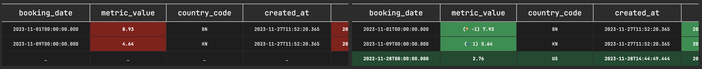
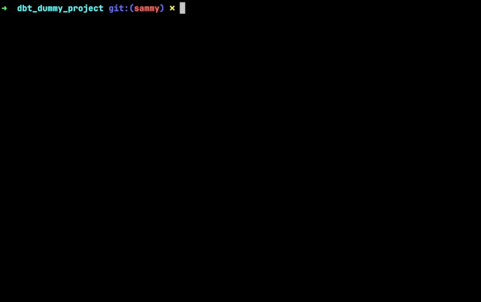

# Dbt Snapshot Diff Visualisation

## Introduction

It is hard to understand what changed during a snapshot at a given date. This CLI shows the snapshot in a git diff style.


## Installation

Install DriftDB Snapshot with pip by running:

```bash
pip install driftdb
```

Usage
To use DriftDB Snapshot, simply run in one of your dbt project:

```bash
driftdb snapshot show
```

This command prompts you to select one of your snapshots, then one of the snapshot date. finally it displays the snapshot in a easy-to-read format.

## Example


